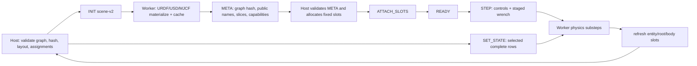

# IsaacSim multi-entity contract proposal

Status: U0 proposal for maintainer review (docs-only; no implementation in this
commit).  The audit was performed against UniSim
`b7522885caa6aa1c6763e56f8303365958e225d3`, official UniSim main
`f69e7b2025a301e6e0ce57021d6baaa232741e1e`, and the versioned SimToolReal
references `baa5096077d5ad48e5c49265593281d6ffc499ce`, `2868d94e93d6c6e9023999dae32d3c59e87b66d1`, and
`84058661e297576f0849a25782c6fc49d611338d`.  The checkout of the original SimToolReal repository was dirty; no
working-tree content was used as evidence.

This proposal is intentionally backend-neutral.  It does not add a task type,
copy a DirectRLEnv, or require UniLab.  IsaacGym is a future consumer of the
same contract, not a deliverable of U0.

## Executive decision

Add only an additive, backend-neutral graph scene input and role-asset variant
types to UniSim.  Keep the current single-MJCF/single-articulation route
byte-for-byte compatible at the public NumPy boundary.  Do **not** add entity
reset, selected-wrench, or qualified resolver methods: the reviewed UniLab
owner already composes selected writes into complete `set_state` rows and
expands selected wrench rows into the existing dense interval-DR payload.

The graph deterministically derives one global qpos/qvel/body layout.  Every
floating entity is addressable through the existing `BackendRootStateLayout`;
every joint and body has a stable, globally unique public name consumed by the
existing name APIs.  The graph is frozen on the host cold path, serialized in
a versioned `INIT` message, materialized by the worker, and acknowledged with
the same derived layout.  Native actor/prim/tensor indices remain worker-private.
`ModelVariantSpec` remains the complete-MuJoCo-model startup variant used by the
existing MuJoCo adapter.

## Audit baselines and citation convention

* UniSim source and line citations refer to
  `b7522885caa6aa1c6763e56f8303365958e225d3`.
* UniLab owner citations refer to the fixed evidence commit
  `05458806a767a89d98915932647c33d42a19b837`.
* Current Manager-Based SimToolReal owner citations refer to versioned commit
  `af5233051b2e0fee844f35485ef4a44767f35e27`.
* Original IsaacSim semantics cite their full file path, full commit SHA, and
  line range.  They were read with `git show`; the dirty original working tree
  was not used.

For compactness, UniSim citations below use `path:line` after this explicit
baseline declaration; UniLab and original SimToolReal citations retain their
full commit inline.

## Current facts and constraints

### Host and public contract

* `SceneCfg` has one required `model_file`; `entities` is only an untyped
  dictionary (`src/unisim/scene.py:41-48`).  No asset graph, role, assignment,
  or source-format contract exists.
* `SimBackend.get_state()` constructs `qpos = [base xyz, base wxyz, dof
  positions]` and `qvel = [base linear velocity, base angular velocity, dof
  velocities]` (`src/unisim/backend/base.py:265-289`).  This is a single-root
  convenience layout, not a multi-entity layout.
* `BackendRootStateLayout` already defines seven root-position columns and six
  root-velocity columns, validates integer/unique/non-negative indices, and
  documents world xyz/wxyz plus world linear/body angular velocity
  (`src/unisim/backend/base.py:57-95`).
* `get_root_state_layout` resolves one floating body only and fails for a fixed
  body (`src/unisim/backend/base.py:415-428`).  Name resolution APIs for bodies
  and joints are cold-path public methods (`src/unisim/backend/base.py:430-440`,
  `:1079-1100`).
* `set_state` accepts selected environment rows but requires a complete qpos/qvel
  row for the one actor (`src/unisim/backend/base.py:581-607`).  There is no
  entity selector.  Graph mode can reuse this exact call by making its complete
  row width the derived `StateLayout` width; the method signature and selected
  row masking do not change.
* `apply_body_force` already states world-frame force/optional torque with shape
  `(num_envs, len(body_ids), 3)` and “upcoming step” staging
  (`src/unisim/backend/base.py:657-680`).  It has no selected-env argument.
* Interval DR is declarative and fail-closed.  Built-in body force/torque specs
  require body IDs and `(num_envs, len(body_ids), 3)` payloads
  (`src/unisim/dr/interval.py:43-93`); a missing backend handler raises
  `NotImplementedError` (`src/unisim/backend/base.py:623-655`).
* `ModelVariantSpec` contains only `source_model_file` and MuJoCo geom-size
  overrides (`src/unisim/dr/types.py:38-46`), while `InitRandomizationPlan` is a
  list of those variants plus integer assignments (`src/unisim/dr/types.py:239-246`).
  The architecture and migration docs explicitly describe this as a MuJoCo
  startup source-model feature (`docs/architecture.md:41-47`,
  `docs/migration.md:28-37`, `CHANGELOG.md:5-9`).

### Existing UniLab owner surface

The fixed UniLab evidence shows that no entity-specific backend write API is
needed:

* `ResetStateTransaction` owns full default/current qpos and qvel arrays and
  explicitly promises one final `SimBackend.set_state` call
  (`src/unilab/base/reset_state.py @
  05458806a767a89d98915932647c33d42a19b837 : 1-5, 31-65`).
* `write_joint_state` stages only the resolved joint columns for selected rows,
  while retaining the other columns from the default/transaction image
  (`src/unilab/base/reset_state.py @
  05458806a767a89d98915932647c33d42a19b837 : 406-469`).
* `write_root_state` uses any `BackendRootStateLayout`; root pose is copied to
  its seven columns and world angular velocity is converted to the existing
  body-frame generalized qvel convention
  (`src/unilab/base/reset_state.py @
  05458806a767a89d98915932647c33d42a19b837 : 471-550`).
* `commit` collects every dirty entity write and submits complete rows once,
  preserving selected-environment isolation
  (`src/unilab/base/reset_state.py @
  05458806a767a89d98915932647c33d42a19b837 : 552-588`).
* `Entity` already resolves its declared root with `get_body_ids`, joints with
  the existing joint-index methods, and bodies with `get_body_ids`; the
  returned IDs are checked for integer dtype, shape, non-negativity, and
  uniqueness (`src/unilab/base/entity.py @
  05458806a767a89d98915932647c33d42a19b837 : 53-84, 582-640, 711-725`).
  It obtains and validates `BackendRootStateLayout` against the complete
  defaults (`src/unilab/base/entity.py @
  05458806a767a89d98915932647c33d42a19b837 : 927-979`).
* `Entity.apply_body_wrench_to_sim` accepts selected rows, validates
  `(len(env_ids), len(body_ids), 3)`, expands them into zero-filled
  `(num_envs, len(body_ids), 3)` arrays, and sends the existing
  `IntervalRandomizationPlan` (`src/unilab/base/entity.py @
  05458806a767a89d98915932647c33d42a19b837 : 1665-1776`).

The existing MuJoCo interval path clears pending external wrenches at the
start of a non-empty plan, accumulates force and torque operations, applies the
dense rows to the upcoming `step`, and clears them after stepping
(`src/unisim/backend/mujoco/backend.py:1260-1319, 1000-1039, 1435-1471`).
IsaacSim must implement those same declared semantics; it does not need a new
selected-wrench method.

The current SimToolReal task uses those paths directly: its reset term stages
robot joint state and object root pose/velocity in one manager transaction
(`src/simtoolreal_rl_unilab/tasks/simtoolreal/reset.py @
af5233051b2e0fee844f35485ef4a44767f35e27 : 99-180`), while its action term
binds public object body IDs and stages dense world-frame force/torque through
`Entity.apply_body_wrench_to_sim`
(`src/simtoolreal_rl_unilab/tasks/simtoolreal/action.py @
af5233051b2e0fee844f35485ef4a44767f35e27 : 234-293, 352-401`).

Therefore a graph-derived complete state row, one existing root layout per
floating entity, and global unique names are sufficient.  There is no concrete
counterexample requiring a new public method; this revision removes the three
previously proposed method/resolver surfaces.

### Subprocess IPC and worker

* `MjcfSubprocessBackend` rejects fragments and requires a self-contained MJCF
  through `scene.model_file` (`src/unisim/backend/subprocess_ipc/backend.py:289-297`).
* `INIT` sends one model path, one root body name, one MJCF body/joint list, one
  keyframe qpos, and position-actuator arrays
  (`src/unisim/backend/subprocess_ipc/backend.py:403-435`).  The host scans XML
  before the handshake; `SceneMetadata` records one document-order joint/body
  list and at most one free-joint body (`src/unisim/backend/subprocess_ipc/sensors.py:147-175`,
  `:544-613`).
* Slots are fixed to one control matrix, one 13-column root state, one DoF
  position/velocity tensor, one body-state tensor, and full-row reset arrays
  (`src/unisim/backend/subprocess_ipc/protocol.py:79-115`).  There is no wrench
  slot, entity reset command, assignment slot, or layout descriptor.
* The host requires worker body/joint order to equal the XML order and exposes
  that order as IDs (`src/unisim/backend/subprocess_ipc/backend.py:584-611`,
  `:935-1001`).  It therefore cannot accept independent robot/table/object
  native orderings.
* The IsaacSim worker converts exactly one MJCF with `MjcfConverter`, clones one
  USD articulation with `GridCloner`, and uses `replicate_physics=False`
  (`src/unisim/backend/isaacsim/worker.py:215-275`).  It creates one
  `Articulation` (`:287-321`), maps importer names back to the one contract list
  (`:376-415`), and publishes only that articulation's root/DoF/body tensors
  (`:538-552`).
* IsaacSim selected reset writes that same articulation's root and joints from
  full 7+DoF/6+DoF rows (`src/unisim/backend/isaacsim/worker.py:584-624`).
  `IsaacSimBackend` advertises no DR capabilities
  (`src/unisim/backend/subprocess_ipc/backend.py:1108-1119`), and the
  subprocess `set_state` rejects a non-empty reset DR payload
  (`src/unisim/backend/subprocess_ipc/backend.py:1051-1061`).
* The worker removes private clone translations before publishing state and
  verifies unique origins/collision filtering (`src/unisim/backend/isaacsim/worker.py:538-552`,
  `src/unisim/backend/isaacsim/backend.py:194-229`).  These are useful
  invariants, but they assume every clone contains the same articulation.

### Versioned SimToolReal evidence

The original IsaacSim config declares separate robot/table URDFs, a 100-sample
pool per selected logical type, and force/torque DR
(`isaacsimenvs/tasks/simtoolreal/simtoolreal_env_cfg.py @
baa5096077d5ad48e5c49265593281d6ffc499ce : 55-101, 478-489`).  Its scene
builder converts role-specific URDFs, bakes object and goal-viz USDs, and spawns
robot, table, object, and goal entities
(`isaacsimenvs/tasks/simtoolreal/utils/scene_utils.py @
2868d94e93d6c6e9023999dae32d3c59e87b66d1 : 151-192, 1539-1705`).  `MultiUsdFileCfg(random_choice=False)` is
used for round-robin object variants
(`isaacsimenvs/tasks/simtoolreal/utils/scene_utils.py @
2868d94e93d6c6e9023999dae32d3c59e87b66d1 : 187-192`), while the config requires `replicate_physics=False` and
`clone_in_fabric=False` for heterogeneous USDs
(`isaacsimenvs/tasks/simtoolreal/simtoolreal_env_cfg.py @
baa5096077d5ad48e5c49265593281d6ffc499ce : 568-585`).

The generator uses a fixed seed, samples each matching distribution, emits one
URDF per sample, normalizes scale, and shuffles paths/scales in lockstep
(`isaacsimenvs/tasks/simtoolreal/utils/generate_objects.py @
2868d94e93d6c6e9023999dae32d3c59e87b66d1 : 302-399`).  At runtime the task resolves canonical robot joint order,
palm and fingertip body IDs, and per-env object state buffers
(`isaacsimenvs/tasks/simtoolreal/utils/reset_utils.py @
2868d94e93d6c6e9023999dae32d3c59e87b66d1 : 23-67`).  Object reset is selected-env only and writes object pose,
velocity, and per-env reference height
(`isaacsimenvs/tasks/simtoolreal/utils/reset_utils.py @
2868d94e93d6c6e9023999dae32d3c59e87b66d1 : 271-301`); full reset clears only selected rows of queues, trackers,
and wrench buffers
(`isaacsimenvs/tasks/simtoolreal/utils/reset_utils.py @
2868d94e93d6c6e9023999dae32d3c59e87b66d1 : 384-418`).  Wrench DR is a per-env `(N, 1, 3)` force and torque,
world-frame, global application staged before physics
(`isaacsimenvs/tasks/simtoolreal/utils/action_utils.py @
2868d94e93d6c6e9023999dae32d3c59e87b66d1 : 77-130`).  Observations read robot palm/fingertips, object and goal
state with delay/noise
(`isaacsimenvs/tasks/simtoolreal/utils/obs_utils.py @
2868d94e93d6c6e9023999dae32d3c59e87b66d1 : 231-340`), rewards update lift/progress/success terms
(`isaacsimenvs/tasks/simtoolreal/utils/reward_utils.py @
2868d94e93d6c6e9023999dae32d3c59e87b66d1 : 92-145`), and termination advances the goal before evaluating
fall/hand-far/timeout masks
(`isaacsimenvs/tasks/simtoolreal/utils/termination_utils.py @
2868d94e93d6c6e9023999dae32d3c59e87b66d1 : 39-72`).  Commit `84058661e297576f0849a25782c6fc49d611338d` additionally authors adjacent-link
`FilteredPairsAPI` self-collision filters
(`isaacsimenvs/tasks/simtoolreal/utils/scene_utils.py @
84058661e297576f0849a25782c6fc49d611338d : 1309-1361`).

These references establish semantics only.  Their DirectRLEnv, IsaacLab views,
actor handles, and task-private fields are not a UniSim interface.

## Gap matrix

| Boundary | Current evidence | Concrete gap | Owner / decision |
|---|---|---|---|
| Scene input | `SceneCfg.model_file` and untyped `entities` (`scene.py:41-48`) | Cannot describe four roles, source format, importer profile, or role variants | **UniSim public** separate graph scene config; maintainer must approve name/version shape |
| XML metadata | One MJCF scanner and one free-joint (`sensors.py:147-175`, `:544-613`) | URDF/USD sources are rejected or incorrectly scanned as MJCF | **Adapter-private** native materializers; graph route bypasses MJCF scan |
| INIT | One `model_file`, one root, one name list (`subprocess_ipc/backend.py:403-435`) | No graph, assignments, cache provenance, or layout version | **Internal IPC** `INIT_V2` payload with protocol version |
| Slots | One root/DoF/body tensor set (`protocol.py:79-115`) | No entity segments, selected reset, or staged wrench | **Internal IPC** additive slots/commands |
| Root state | Root-first 7/6 layout and one-body layout (`base.py:57-95`, `subprocess_ipc/backend.py:935-951`) | Fixed-base robot plus dynamic object cannot share one root | **Public** layout descriptor plus legacy mode |
| State write | Full actor qpos/qvel rows (`base.py:581-607`; worker `:584-624`) | Needs graph-derived complete row; no new entity write method | **Reuse** `ResetStateTransaction` + `set_state`; worker writes segment columns |
| Names | Global IDs in importer/XML order (`subprocess_ipc/backend.py:957-1001`) | Graph must publish globally unique public names and worker permutation | **Reuse** `get_body_ids` / existing joint APIs; no new resolver |
| Variants | `ModelVariantSpec` is complete MJCF source (`dr/types.py:38-46`) | Cannot assign object/table/goal role assets | **Public additive** role-asset variant; preserve `ModelVariantSpec` |
| Wrench | All-env world-frame API (`base.py:657-680`) | Isaac worker lacks transport/effect implementation; selected rows are already densified by UniLab | **Reuse** `apply_body_force` / `IntervalRandomizationPlan`; **worker** implementation only |
| DR | Built-in shape is all-env and Isaac capability set is empty (`interval.py:52-93`, `subprocess_ipc/backend.py:1108-1119`) | SimToolReal force/torque and required reset DR fail closed | Capability declaration plus real physics conformance; no silent downgrade |
| Heterogeneous USD | Current worker clones one USD articulation (`isaacsim/worker.py:238-321`) | Fabric/replication can erase per-env asset identity | IsaacSim adapter-private spawning policy, tested with real runtime |
| Cache | Current worker converts on every single-model materialization (`isaacsim/worker.py:237-251`) | No content-addressed URDF→USD cache, atomicity, or diagnostics | UniSim cache owner; task owns canonical source manifest |
| Compatibility | Existing tests cover fake contract, DR, and MuJoCo variants (`tests/test_contract.py:13-58`, `tests/test_dr_interval.py:38-176`, `tests/test_mujoco_model_variants.py:40-88`) | No old/new scene conformance pair | U1 adds legacy-preservation tests before enabling new route |

## Proposed public types

Names below are semantic proposals; maintainers may choose final class names, but
the fields and invariants are normative.

### Asset graph

```text
AssetSource
  format: "mjcf" | "urdf" | "usd"
  uri: non-empty opaque source locator
  source_revision: non-empty immutable revision or None
  sha256: lowercase 64-hex content hash

ImporterProfile
  name: non-empty profile identifier
  options: immutable string -> scalar map (str | int | float | bool)

RoleAssetVariant
  variant_id: non-empty unique string within an entity
  source: AssetSource
  importer: ImporterProfile
  role_metadata_hash: lowercase 64-hex hash
  scale: finite float32 tuple (3,)

NameBinding
  public_name: non-empty globally unique name used by existing SimBackend APIs
  source_name: non-empty name in this variant's importer namespace

EntityDescriptor
  name: non-empty stable name, unique in graph
  kind: "articulation" | "rigid" | "kinematic" | "visual"
  fixed_base: bool
  gravity_enabled: bool
  collision_enabled: bool
  visual_only: bool
  root_body_name: non-empty name or None
  joint_bindings: unique tuple[NameBinding]
  body_bindings: unique tuple[NameBinding]
  variants: non-empty tuple[RoleAssetVariant, ...]
  env_variant_ids: int32 array shape (num_envs,)
  include_root_state: bool
  default_joint_qpos: finite float array shape (len(joint_bindings),)
  default_joint_qvel: finite float array shape (len(joint_bindings),)
  default_root_qpos: finite float array shape (7,) or None
  default_root_qvel: finite float array shape (6,) or None

SceneAssetGraph
  schema_version: positive int
  num_envs: positive int
  entities: immutable tuple[EntityDescriptor, ...]
  manifest_hash: lowercase 64-hex hash

GraphSceneCfg
  graph: SceneAssetGraph
  cache_root: absolute path or None
  terrain: TerrainSceneCfg or None
```

`EntityDescriptor` is deliberately generic.  A fixed-base robot articulation,
dynamic object rigid body, fixed/kinematic table, and visual-only goal object are
represented respectively by `kind`, `fixed_base`, `gravity_enabled`,
`collision_enabled`, and `visual_only`; no robot or task class appears in the
contract.  `joint_bindings` and `body_bindings` map source importer names to
stable public names; public names are unique across the whole graph even when
two source assets use the same local name.  The goal entity may share the
object's variant IDs but must have
`visual_only=True`, `collision_enabled=False`, and `gravity_enabled=False`.
Assignments are explicit per environment; directory ordering, implicit random
choice, and worker RNG are not assignment sources.

Validation is cold-path and fail-closed:

1. Names, variant IDs, formats, profile names, revisions, and hashes have the
   declared non-empty/hex forms; names are unique within their entity and
   entity-qualified names are unique graph-wide.
2. `env_variant_ids` is int32, one-dimensional, exactly `num_envs` long, and
   every index is in `[0, len(variants))`.
3. `public_name` values are unique graph-wide; `source_name` values are unique
   within each entity/variant.  Every variant must resolve every binding exactly
   once.  `root_body_name`, when present, must refer to one body binding.
4. `articulation` entities have at least one joint; `rigid`, `kinematic`, and
   `visual` entities have no joints.  `fixed_base=True` on an articulation
   forbids a root-state segment; fixed/kinematic rigid entities may still expose
   a writable root.  A dynamic rigid entity must have exactly one root body and
   `include_root_state=True`.
   The initial graph contract permits only one-DoF joints, so one binding equals
   one qpos and one qvel column; any multi-DoF joint fails closed.
5. Default arrays have exactly the declared widths.  Root qpos is xyz+wxyz,
   root qvel is world-linear/body-angular; quaternions are finite and unit
   length.  An entity with `include_root_state=False` must provide no root
   defaults.  Scales and all other numeric metadata are finite.  Unsupported
   `format`, importer option, role, or capability is a construction error,
   never a fallback.
6. `manifest_hash` covers canonical serialized fields, bindings, defaults, and
   assignment arrays.
   Mutating an input array after construction is impossible (copy and mark
   read-only).
7. `GraphSceneCfg.graph` must be a validated `SceneAssetGraph`; `cache_root`,
   when present, is one absolute existing-or-creatable directory and is the
   only cache root in the request.  `GraphSceneCfg` has no legacy model path.

`StateLayout` is not caller input.  `derive_state_layout(SceneAssetGraph)` is
the single owner of layout generation; it returns immutable metadata described
below.  Callers cannot provide a second competing layout.

### Mutually exclusive scene inputs

Keep `SceneCfg(model_file=...)` unchanged for every legacy consumer.  Introduce
the separate `GraphSceneCfg(graph=..., cache_root=...)` input rather than making
`model_file` nullable.  The backend factory accepts exactly one of these two
types; a mapping that supplies both, a missing graph, or an unknown scene type
is rejected before materialization.  A `GraphSceneCfg` has no `model_file`,
`fragment_files`, or MJCF keyframe selector, so the graph route cannot enter
`scan_scene_metadata`.  A `SceneCfg` with a non-empty `model_file` always takes
the current MJCF path; its behavior and constructor compatibility do not
change.

UniLab's existing `unilab.base.scene.SceneCfg` remains the subclass of
`unisim.scene.SceneCfg` and continues to materialize Hydra entity mappings.  A
future graph owner adds a sibling `unilab.base.scene.GraphSceneCfg` subclass of
`unisim.scene.GraphSceneCfg` and performs the same entity-mapping conversion;
it does not put a graph into the legacy `model_file` field.  Existing config
adapters that replace or inspect `SceneCfg.model_file` stay on the legacy branch;
the graph owner passes its resolved `GraphSceneCfg` directly to `create_backend`.

### State layout

`StateSegment` and `EntityStateLayout` are read-only derived types; callers do
not supply them:

```text
StateSegment
  entity_name: non-empty string
  component: "root" | "joints"
  qpos_start: non-negative int
  qpos_width: positive int
  qvel_start: non-negative int
  qvel_width: positive int
  public_names: tuple[str, ...]

EntityStateLayout
  entity_name: string
  root: BackendRootStateLayout | None
  joint_qpos_indices: int tuple (len(joint_bindings),)
  joint_qvel_indices: int tuple (len(joint_bindings),)
  body_public_names: tuple[str, ...]
  body_ids: int32 readonly array (len(body_bindings),)

StateLayout
  qpos_width: positive int
  qvel_width: positive int
  segments: tuple[StateSegment, ...]
  entities: tuple[EntityStateLayout, ...]
  public_joint_names: tuple[str, ...]
  public_body_names: tuple[str, ...]
  default_qpos: float readonly array (qpos_width,)
  default_qvel: float readonly array (qvel_width,)
```

Validation of the derived types is deterministic: segment starts and widths
are Python integers (not bool), widths are positive, component names have the
exact declared length, segment public names are unique, and every index lies in
the complete qpos/qvel width.  `EntityStateLayout.root` is either `None` or an
existing `BackendRootStateLayout` with exactly seven qpos and six qvel columns;
joint index tuples are integer, unique, and in range.  `body_ids` is int32,
one-dimensional, read-only, and has one entry per body binding.  Default arrays
are one-dimensional finite floating arrays with exactly `qpos_width` and
`qvel_width` entries.  A worker `META` that changes any of these fields or the
graph hash is rejected before slots attach.

`derive_state_layout(graph)` visits the graph's entity tuple in declared order.
For each entity it emits a root segment first when `include_root_state=True`,
then a joints segment when joints exist.  Segment order, public names, and
default arrays are therefore determined by the descriptor and included in the
graph hash; there is no caller-provided second truth.

| Segment | qpos columns | qvel columns | Notes |
|---|---:|---:|---|
| fixed-base articulation | `nq_joints` | `nv_joints` | Canonical joint order from descriptor |
| dynamic/kinematic rigid root | 7: `xyz + wxyz` | 6: `v_world + w_body` | Root body named by descriptor |
| floating articulation | 7 + joints | 6 + DoFs | Future-compatible; only if declared |
| visual-only goal | optional 7 | optional 6 | Included only when state is requested |

For the proposed manipulation graph the canonical order is robot joint columns,
then object root columns, then any additional declared segments in descriptor
order.  `qpos_start`/`qvel_start` must be contiguous: starts at zero, widths are
positive, the next start equals the previous end, and the final ends equal
`qpos_width`/`qvel_width`.  Thus there are no overlaps or holes.  A fixed-base
robot contributes joints only; a dynamic object contributes one seven/six root
segment; a table or visual goal contributes a root only when its descriptor
sets `include_root_state=True`.

`get_state()` for a graph scene is a backend override that returns the
concatenation described by the derived `StateLayout`; `get_state()` for a legacy scene remains exactly
root-first `[root, dofs]`.  Body state is always
`(num_envs, num_bodies, 13)` in global public-name order: position 3,
quaternion wxyz 4, world linear velocity 3, world angular velocity 3.
`get_root_state_layout(root_body_name)` remains the existing API for each
floating entity and returns the seven/six columns of that entity's root segment.

Default qpos/qvel are the descriptor defaults concatenated in segment order.
Root qpos is world xyz/wxyz; generalized qvel stores world linear and body-frame
angular velocity, exactly as `BackendRootStateLayout` and
`ResetStateTransaction` already specify.  Worker `META` must echo graph hash,
segment starts/widths, public joint/body names, default widths, and each
source-to-public permutation; the host rejects any mismatch before `READY`.

The graph uses stable global public names such as `robot_joint_1`, `robot_palm`,
`robot_fingertip_0`, and `object_root`.  Existing `get_body_ids` and joint-name
APIs resolve those names once on the cold path.  No `JointIndexView`,
`BodyIndexView`, qualified resolver, or entity-specific state/wrench method is
retained.  UniLab's `Entity` keeps its existing local name tuples and cached
backend IDs; the graph's only new requirement is that descriptors guarantee
global uniqueness and variant signature stability.

Selected reset and selected wrench behavior therefore stay at the owner layer:
`ResetStateTransaction` merges robot/object/table/goal column writes into one
complete-row `set_state`, while `Entity.apply_body_wrench_to_sim` expands
selected rows into dense all-env `IntervalRandomizationPlan` payloads.  UniSim
only needs to make the graph-derived complete layout and dense wrench path work
in the worker; no new public operation is required.

## Proposed internal IPC types

These are private to `unisim.backend.subprocess_ipc` and are not imported by
UniLab:

```text
InitScenePayloadV2
  protocol_version: "scene-v2"
  graph: serialized SceneAssetGraph (including manifest hash)
  state_layout: serialized StateLayout
  cache_policy: {root, read_only, expected_converter_version}
  render_options: existing IsaacSim fields

EntityMeta
  entity_name, kind, variant_count, env_variant_ids
  public_joint_names, public_body_names
  derived qpos/qvel segments and complete-row widths
  capability flags

WorkerMetaV2
  graph_hash, converter/cache versions
  public entity/body/joint names
  native-to-public permutations (worker-owned after validation)
  per-env local origins, collision-filter status

DenseWrenchBatch (internal only)
  body_ids: int32 shape (K,)
  force: float32 shape (num_envs, K, 3)
  torque: optional float32 shape (num_envs, K, 3)
  selected rows are already zero-filled by the UniLab Entity owner
```

The existing `INIT`, slots, and commands are retained for the legacy route.  A
graph route negotiates `scene-v2` and rejects unknown versions, malformed hashes,
missing entities, assignment length mismatches, layout gaps, or unsupported
capabilities.  `CMD_SET_STATE` keeps its existing selected environment IDs but
its qpos/qvel slot widths are the derived complete graph widths.  Additional
internal slots carry dense body-force/body-torque arrays and body IDs for the
existing interval plan; there is no entity-reset command.  Fixed slot capacity
is computed during `INIT`; a request exceeding it fails before writes.
No tensor/zero-copy extension is proposed until a profile demonstrates that
NumPy shared-memory copies block an accepted capacity gate.

### INIT and data flow



The worker may keep native actor/prim/tensor indices and converted USD paths;
they are immutable after `META` and never become task-visible.  Host immutable
metadata is the validated graph, hash, public names, layout slices, assignment
arrays, cache provenance, and capability set.  Worker immutable metadata is the
native name permutations, prim/actor indices, environment origins, and slot
offsets.  Runtime mutable state is limited to numeric tensors, reset/wrench
staging arrays, and physics handles; no XML/URDF/USD parsing or hash computation
is allowed after materialization.

## Cold path versus hot path

| Cold path (init/materialize/cache) | Hot path (step/reset/reward/DR) |
|---|---|
| Validate graph, source hashes, revisions, importer profile, assignments | Use frozen virtual IDs, slices, assignments, and numeric arrays |
| Parse MJCF for the legacy route; generate/convert URDF and USD for graph route | Read/write shared-memory state and controls |
| Compute cache key, lock, atomically write and hash artifacts | Stage world-frame wrench and selected reset rows |
| Resolve public names and native permutations | Apply cached native IDs; no name lookup |
| Create GridCloner prims, actor views, collision filters, Fabric policy | Physics stepping, state refresh, reward/termination consumers |
| Build capability and interval handler tables | Fail immediately on shape/capability violations |

## URDF→USD materialization and cache ownership

The task owner supplies a backend-neutral canonical manifest and role-specific
URDF source descriptors.  It owns sampling seed/schema, authored dimensions,
mass/COM/inertia, topology/material identifiers, source revision/license, and
the deterministic `env_variant_ids` assignment.  It does not import IsaacSim,
create prims, or call a converter.

The task owner also owns the task cache policy.  It resolves exactly one
absolute cache root using `SIMTOOLREAL_CACHE_DIR`, then XDG's task cache, then
`~/.cache/simtoolreal`, and passes that resolved root as
`GraphSceneCfg.cache_root` on the cold path.  A call must not provide a second
root through an environment override or worker payload; UniSim rejects a
conflicting root rather than choosing precedence implicitly.

UniSim owns the converter invocation in the IsaacSim worker, role importer
profiles, PhysX bake validation, cache content format, cache locking, cache
lifetime, and diagnostics.  When `cache_root` is supplied, UniSim uses it
verbatim and does not consult `~/.cache/unisim`; the latter is used only when
the caller explicitly leaves `cache_root=None`.  The cache key is the tuple:

```text
manifest_hash
+ source revision and source sha256
+ URDF generator schema/version
+ IsaacSim and IsaacLab versions
+ importer profile/options
+ PhysX bake profile/version
```

The task-resolved root and UniSim's default root are mutually exclusive; a
single invocation cannot create two caches for one manifest.  Neither root may
be inside tracked source.  Materialization writes to a unique temporary sibling, fsyncs
files and directory, validates the expected manifest/hash/version, then renames
atomically.  A lock prevents duplicate writers.  A cache hit revalidates the
manifest and converter/bake versions; a mismatch is a miss, not a silent reuse.
Errors identify entity, variant ID, source hash, importer profile, converter
version, and the failed phase (parse, convert, bake, validate, or atomic
publish).  Only a call-owned temporary directory is removed on close/error;
shared cache entries persist.

## IsaacSim heterogeneous USD constraints

The IsaacSim adapter must use `GridCloner` only for environment roots and must
instantiate each role/variant explicitly.  For heterogeneous USD, the validated
policy is `replicate_physics=False` and `clone_in_fabric=False`: PhysX must parse
each environment's subtree and `MultiUsdFileCfg`-style spawners must see every
USD prim, not Fabric-only clones.  Collision filtering is applied per
environment before the first reset.  Round-robin is allowed only as an adapter
implementation of an already explicit assignment array; random choice is not.
The worker must report unique origins and collision-filter status.  Any runtime
that cannot preserve per-env asset identity, role body names, or physics
replication semantics fails closed.  This is an IsaacSim implementation rule,
not a public dependency on GridCloner or Fabric.

## Reuse versus new public contract

Reusable without semantic change:

* `SimBackend` lifecycle, `reset(env_ids)`, `step(ctrl, nsteps)`, body pose/
  velocity getters, sensor views, and lazy backend factory.
* Existing `BackendRootStateLayout` representation for each dynamic root.
* Legacy `set_state` for complete single-actor rows.
* Existing all-env `apply_body_force` shape/frame/one-step staging.
* `DomainRandomizationCapabilities`, `IntervalTermOp`, and fail-closed handler
  dispatch for dense all-env DR.
* `SceneCfg.model_file` and MJCF scanner for single-model consumers.

The graph route adds only these public data/configuration types:

* `GraphSceneCfg`, `SceneAssetGraph`, `AssetSource`, `ImporterProfile`,
  `RoleAssetVariant`, `NameBinding`, and `EntityDescriptor`.
* Derived `StateSegment`, `EntityStateLayout`, and `StateLayout` metadata,
  including complete-row defaults and global public-name lists.
* A capability bit for graph materialization/heterogeneous assignment, without
  changing the old reset or wrench methods.

The existing `set_state`, `get_root_state_layout`, `get_body_ids`/joint APIs,
`IntervalRandomizationPlan`, and `apply_body_force` are the public operations
used by graph consumers.  No new public method is justified: the concrete
owner call chain above is already able to express selected multi-entity reset
and dense selected-env wrench writes.

Adapter-private only:

* IsaacSim URDF/USD conversion, cache files, Prim paths, actor/view handles,
  GridCloner/Fabric settings, PhysX filtering, and native tensor permutations.
* IPC slot names/counts, `INIT_V2` serialization, worker command framing, and
  Python 3.11/Kit process management.

No task or UniLab dependency is added to UniSim.

## Backward compatibility and `ModelVariantSpec` decision

Legacy scenes continue to pass one `model_file`, scan one MJCF, receive the
existing slots, expose root-first qpos/qvel, and use the same `set_state`, body
IDs, and `apply_body_force` calls.  The old `INIT` payload and protocol version
remain supported.  `GraphSceneCfg` selects the new negotiated mode by type;
there is no ambiguous graph field on legacy `SceneCfg`.  Existing fake, MuJoCo,
IsaacGym, and IsaacSim single-articulation consumers require no source change.

`ModelVariantSpec` remains a **complete MuJoCo model variant**.  Extending it
with URDF/USD role fields would make `source_model_file` ambiguous, force an MJCF
scanner to parse non-MJCF paths, and change the proven MuJoCo identity semantics
tested in `tests/test_mujoco_model_variants.py:40-88`.  `RoleAssetVariant` is a
new graph type.  A future migration may add a conversion helper from a complete
MuJoCo variant to a graph only when the source semantics are explicit; it must
not overload the existing field.

## Minimal usage example (proposed graph input)

```python
from pathlib import Path

import numpy as np

from unisim import create_backend
from unisim.scene_assets import (
    AssetSource, EntityDescriptor, GraphSceneCfg, ImporterProfile, NameBinding,
    RoleAssetVariant, SceneAssetGraph, derive_state_layout,
)

def variant(name: str, profile: str) -> RoleAssetVariant:
    return RoleAssetVariant(
        variant_id=name,
        source=AssetSource("urdf", f"assets/{name}.urdf", "revision-1", "a" * 64),
        importer=ImporterProfile(profile, {"self_collision": False}),
        role_metadata_hash="b" * 64,
        scale=(1.0, 1.0, 1.0),
    )

env_ids = np.zeros(2, dtype=np.int32)
robot = EntityDescriptor(
    name="robot", kind="articulation", fixed_base=True,
    gravity_enabled=False, collision_enabled=True, visual_only=False,
    root_body_name=None,
    joint_bindings=(NameBinding("robot_joint_0", "joint_0"),
                    NameBinding("robot_joint_1", "joint_1")),
    body_bindings=(NameBinding("robot_palm", "palm"),
                   NameBinding("robot_fingertip_0", "fingertip_0")),
    variants=(variant("robot-v1", "fixed-base-robot"),),
    env_variant_ids=env_ids, include_root_state=False,
    default_joint_qpos=np.zeros(2), default_joint_qvel=np.zeros(2),
    default_root_qpos=None, default_root_qvel=None,
)
object_entity = EntityDescriptor(
    name="object", kind="rigid", fixed_base=False,
    gravity_enabled=True, collision_enabled=True, visual_only=False,
    root_body_name="object_root",
    joint_bindings=(), body_bindings=(NameBinding("object_root", "root"),),
    variants=(variant("object-v1", "dynamic-rigid"),),
    env_variant_ids=env_ids, include_root_state=True,
    default_joint_qpos=np.zeros(0), default_joint_qvel=np.zeros(0),
    default_root_qpos=np.array([0, 0, 0.65, 1, 0, 0, 0]),
    default_root_qvel=np.zeros(6),
)
table = EntityDescriptor(
    name="table", kind="kinematic", fixed_base=True,
    gravity_enabled=False, collision_enabled=True, visual_only=False,
    root_body_name="table_root",
    joint_bindings=(), body_bindings=(NameBinding("table_root", "root"),),
    variants=(variant("table-v1", "kinematic-table"),),
    env_variant_ids=env_ids, include_root_state=True,
    default_joint_qpos=np.zeros(0), default_joint_qvel=np.zeros(0),
    default_root_qpos=np.array([0, 0, 0.38, 1, 0, 0, 0]),
    default_root_qvel=np.zeros(6),
)
goal = EntityDescriptor(
    name="goal", kind="visual", fixed_base=True,
    gravity_enabled=False, collision_enabled=False, visual_only=True,
    root_body_name="goal_root",
    joint_bindings=(), body_bindings=(NameBinding("goal_root", "root"),),
    variants=(variant("object-v1", "visual-goal"),),
    env_variant_ids=env_ids, include_root_state=True,
    default_joint_qpos=np.zeros(0), default_joint_qvel=np.zeros(0),
    default_root_qpos=np.array([0, 0, 0.75, 1, 0, 0, 0]),
    default_root_qvel=np.zeros(6),
)

graph = SceneAssetGraph(
    schema_version=1, num_envs=2,
    entities=(robot, object_entity, table, goal), manifest_hash="c" * 64,
)
layout = derive_state_layout(graph)
scene = GraphSceneCfg(graph=graph, cache_root=Path("/tmp/simtoolreal-cache").resolve())
backend = create_backend("isaacsim", scene=scene, num_envs=2, sim_dt=1.0 / 120.0)
backend.materialize()

# Reset selected env 1 by editing a complete graph row; all other entities and
# env 0 stay at their transaction defaults.
qpos = np.broadcast_to(layout.default_qpos, (2, layout.qpos_width)).copy()
qvel = np.broadcast_to(layout.default_qvel, (2, layout.qvel_width)).copy()
object_root = layout.entities[1].root
qpos[1, object_root.qpos_indices] = [0, 0, 0.70, 1, 0, 0, 0]
backend.set_state(np.array([1], dtype=np.int32), qpos[1:2], qvel[1:2])

# Selected rows are made dense by the Entity owner before this existing API.
object_body = backend.get_body_ids(["object_root"])
force = np.zeros((2, 1, 3), dtype=np.float32)
torque = np.zeros_like(force)
force[1, 0] = [0, 0, 1]
backend.apply_body_force(object_body, force, torque=torque)
backend.step(np.zeros((2, backend.num_actuators), dtype=np.float32))
```

This is a complete graph construction with no XML placeholder.  It is an API
sketch, not real IsaacSim evidence; the task owner supplies the resolved source
URIs, hashes, and cache root on its cold path.

## Conformance test matrix

| Behavior | Unit/fake worker | Real IsaacSim required | Evidence boundary |
|---|---:|---:|---|
| Graph/hash/schema validation and fail-closed unknown fields | Yes | No | Pure NumPy/stdlib tests |
| Legacy `SceneCfg`/`INIT`/slots and qpos/qvel shape | Yes | No (plus existing adapter tests) | Existing consumers unchanged |
| Explicit assignment length/range and stable global public names | Yes | No | Fake native-name permutation |
| Descriptor-derived layout slices, root frame conversion, selected row masking | Yes | No | Fake worker must prove untouched rows through complete `set_state` |
| IPC serialization, slot bounds, malformed META diagnostics | Yes | No | Protocol fixture tests |
| URDF/USD cache key, atomic publish, version mismatch | Fake converter | No for atomic logic | Native converter smoke separately |
| IsaacSim robot/object/table/goal prim creation | No | **Yes** | Native Kit/PhysX stage census |
| Fixed-base robot 29-joint response and palm/fingertip mapping | No | **Yes** | Real state read/target response |
| Object-only reset leaves robot/table/goal and other env unchanged | Yes (dense row merge) | **Yes** | 2–8 env complete-row `set_state` probe |
| World-frame force/torque effect on next physics step | Yes (dense plan/staging) | **Yes** | Acceleration/torque differential probe |
| Heterogeneous hammer/eraser assignment and mass/scale | No | **Yes** | Distinct USD and physical response |
| Fabric/replication policy and collision isolation | No | **Yes** | Stage and PhysX filtering inspection |
| 1200 materialization/cache hit census | No | **Yes** | 12 distributions × 100 native artifacts |
| 29/140/162 finite ABI, lifecycle/reward/termination parity | Fake term tests | **Yes** for backend evidence | Differential manager rollout |
| Native SAPG train/checkpoint/player | No | **Yes** | Real IsaacSim runtime only |

Mock/fake tests can prove array safety, protocol shape, masking, and diagnostics;
they must never be reported as real IsaacSim support or training evidence.

## U1/U2/U3 implementation split

### U1 — public contract, IPC schema, compatibility tests

Proposed files in separate commit:

* `src/unisim/scene.py` and a new backend-neutral `src/unisim/scene_assets.py`:
  immutable graph, descriptors, variants, deterministic layout derivation, and
  validation.  Add `GraphSceneCfg` without changing legacy `SceneCfg`.
* `src/unisim/backend/base.py`: graph capability and complete-row layout
  metadata only; preserve `set_state`, `get_root_state_layout`, global name
  APIs, and `apply_body_force` exactly.
* `src/unisim/dr/types.py` only if a reusable reset/wrench request type belongs
  there; do not alter `ModelVariantSpec` semantics.
* `src/unisim/backend/subprocess_ipc/protocol.py` and `backend.py`: protocol
  version negotiation, graph INIT, complete-row layout metadata, dense wrench
  slots, and bounds checks.  Keep `CMD_SET_STATE`; do not add an entity-reset
  command.
* `tests/test_contract.py`, `tests/test_dr_interval.py`, new graph/protocol tests,
  and a fake multi-entity backend/conformance fixture proving complete-row
  selected reset and dense selected-env wrench isolation.

U1 commit must pass `make check`, demonstrate the old single-MJCF route, and
reject unknown graph capabilities before any worker mutation.  It cannot claim
IsaacSim runtime support.

### U2 — one hammer, 2–8 env real IsaacSim vertical slice

Proposed files:

* `src/unisim/backend/isaacsim/backend.py` and `worker.py`: native role loaders,
  cached global name maps, one robot articulation plus object/table/goal rigid
  views, complete graph-row reset, and state publication.
* `src/unisim/backend/isaacsim/assets.py` (or equivalent): converter/cache key,
  atomic materialization, version diagnostics.
* IsaacSim-specific worker smoke/conformance tests and an external evidence
  record; no UniLab task import.

U2 is gated on U1 maintainer acceptance and must prove one real tool, object
  reset, robot joint/body reads, and wrench physics effect.  It must not start a
  1200-pool optimization.

### U3 — heterogeneous assignment, complete-row reset, dense wrench

Proposed files:

* Extend the U2 worker/cache path for at least two physically different variants,
  explicit per-env assignment, role metadata, and goal-viz pairing.
* `src/unisim/backend/subprocess_ipc/protocol.py` only for bounded dense/selected
  wrench payloads discovered by U2; no unprofiled tensor IPC.
* New conformance tests covering env isolation, duplicate IDs, mixed complete
  rows, body wrench accumulation/clear timing, collision filtering, cache
  hit/miss, and native name permutation.

U3 must provide real IsaacSim evidence for hammer+eraser (or equivalent
  dissimilar assets), but still does not open a SimToolReal route or SAPG gate.
  U4 later owns final conformance/changelog/release after U3 review.

## Versioning, release, and maintainer decisions

The graph and additive methods should ship in the next minor UniSim release with
an explicit contract/schema version.  `INIT` protocol changes are negotiated;
legacy workers continue to serve legacy scenes.  Removing or changing
root-first state, `ModelVariantSpec`, all-env wrench semantics, or existing slot
names requires a major release and migration note.  A worker/cache converter
version change invalidates cache keys and must be recorded with the exact
IsaacSim/IsaacLab revisions.  UniLab may pin a released UniSim version only
after U1–U3 evidence and an immutable revision; no sibling/path/floating source
is acceptable.

Maintainers must decide before U1:

1. Accept the separate `GraphSceneCfg` plus `SceneAssetGraph` contract versus a
   different public name/module, and choose the schema/version negotiation
   policy.  Confirm the strict XOR with legacy `SceneCfg.model_file`.
2. Approve descriptor-derived segment order and whether visual-only roots are
   included in default `get_state()`.
3. Confirm that existing complete-row `set_state`, `BackendRootStateLayout`,
   global name APIs, `IntervalRandomizationPlan`, and dense `apply_body_force`
   are the only runtime public operations required.
4. Define the supported importer-profile registry and which profiles are
   guaranteed for URDF, USD, and legacy MJCF.
5. Confirm that task owners resolve and pass exactly one task cache root while
   UniSim owns URDF→USD conversion/cache content, including cache validation.
6. Set the IsaacSim/IsaacLab/PhysX support matrix and whether IsaacGym Preview
   4 remains a future implementation target.
7. Decide whether reset/interval DR beyond force/torque is in U2/U3 or a later
   capability; every omitted term must remain fail-closed.
8. Decide what evidence threshold unlocks U4 and a released public contract;
   fake-worker success cannot substitute for native runtime evidence.

## Alternatives considered

* **Put URDF/USD paths into `ModelVariantSpec.source_model_file`.** Rejected:
  it violates the MJCF scanner contract, makes source format ambiguous, and
  breaks existing MuJoCo identity/tests.
* **Make `SceneCfg.model_file` nullable and add an `asset_graph` field.**
  Rejected for U1: it creates a two-source object with weak XOR validation and
  invites legacy config adapters to run the MJCF scanner.  A sibling
  `GraphSceneCfg` makes the input type and route explicit while preserving every
  `SceneCfg(model_file=...)` caller.
* **Keep a complete MJCF per object and convert 1200 full scenes.** Acceptable
  only for a small feasibility probe; it repeats robot conversion and still
  needs multi-actor state, reset, assignment, and wrench APIs.
* **Expose IsaacLab `Articulation`/`RigidObject` or PhysX views publicly.**
  Rejected as backend leakage and incompatible with future IsaacGym.
* **Use `getattr`/`hasattr`, fallback, or swallowed exceptions to detect support.**
  Rejected; capability declarations and versioned validation must fail closed.
* **Add `set_entity_state`, `apply_body_wrench`, or a new qualified resolver.**
  Rejected after owner audit: `ResetStateTransaction` already merges complete
  rows, `Entity.apply_body_wrench_to_sim` already densifies selected rows, and
  existing global name APIs already cache public IDs.
* **Force all entities into one virtual articulation.** Rejected: it loses
  fixed-base versus dynamic-root semantics.  The graph instead derives one
  complete global qpos/qvel row while retaining a root layout per floating
  entity.
* **Enable Fabric/physics replication for heterogeneous USD by default.**
  Rejected by the versioned IsaacSim config evidence; per-env physical prims are
  required until a native runtime proves another policy.
* **Add zero-copy/tensor IPC now.** Deferred; correctness and a measured profile
  must precede a separate performance contract.

## Non-goals

This U0 proposal does not implement production code, IsaacSim or IsaacGym
workers, UniLab owner YAML/registry, SAPG support, task rewards/observations,
asset downloads, URDF generation, USD binaries, checkpoints, or performance
claims.  It does not declare SimToolReal IsaacSim support, 1200-tool support,
6144/24576-environment capacity, or natural-success rates.  Those claims require
the staged U2/U3/U4 and UniLab gates on the final released dependency set.
